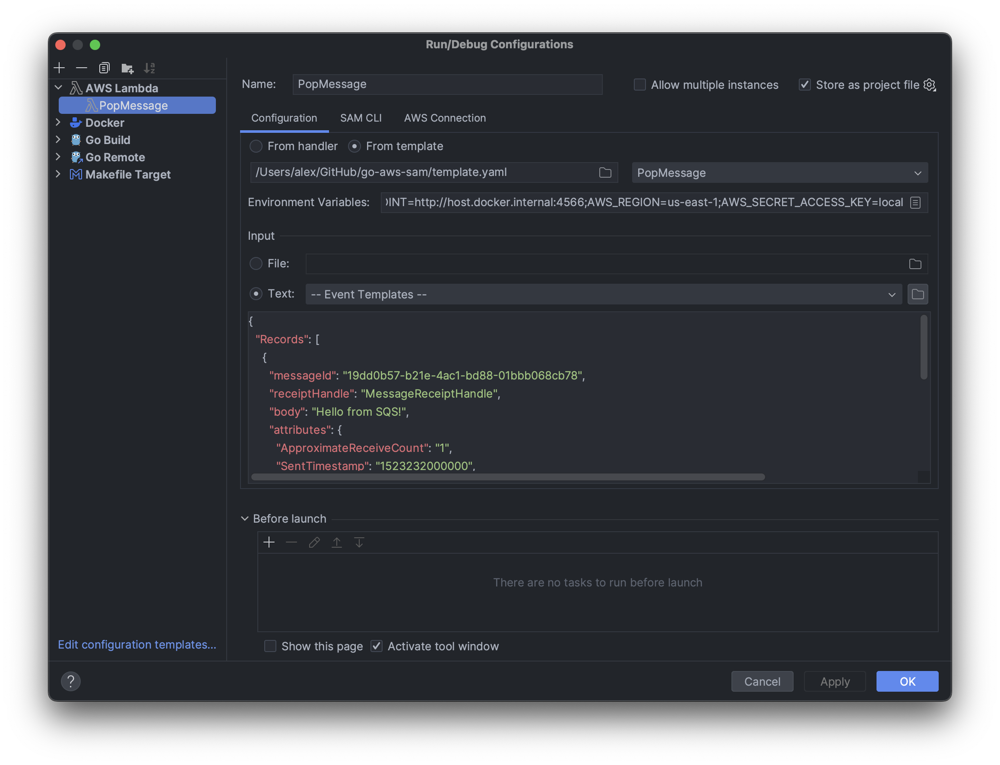

# go-aws-sam

### Running AWS Serverless Application Model (SAM).

⚠️ Run [LocalStack](docker-compose.yaml) and create **MyQueue**
```
aws sqs create-queue --queue-name MyQueue --endpoint-url http://localhost:4566 --profile localstack
```
---
📌 Run **PutMessageApi** function
- build function and start local API
```
sam build PutMessageApi
sam local start-api --skip-pull-image
```
- send request to invoke function
```
curl -X POST -d '{"queue":"000000000000/MyQueue"}' http://127.0.0.1:3000/api/put-message
```

📌 Run **PutMessage** function
```
sam build PutMessage
sam local invoke PutMessage -e events/event.json --skip-pull-image
```

📌 Run **PopMessage** function
```
sam build PopMessage
sam local generate-event sqs receive-message --body 'Hello, World!' | sam local invoke -e - PopMessage --skip-pull-image
```
---
📎 Create a new SAM configuration
```
sam init --runtime go1.x
```

🐞 Debugging SAM on Apple M1 has bug https://github.com/aws/aws-toolkit-jetbrains/issues/3061
