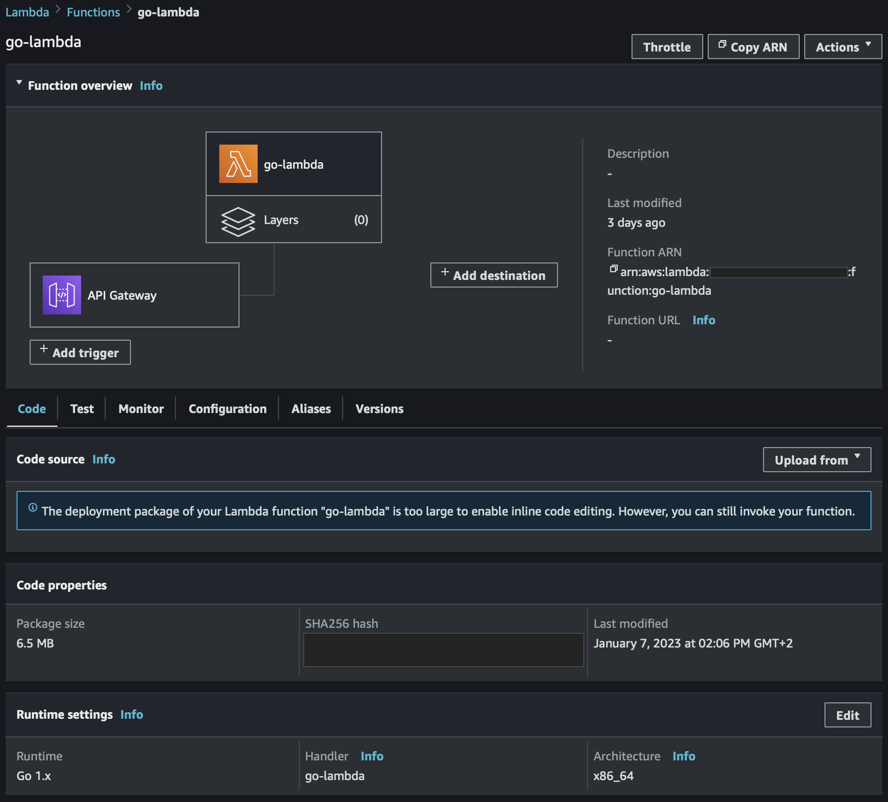

# go-aws-serverless

### Running AWS Serverless Application Model (SAM) as is the lambda function on demand.

🐞 Debugging the local AWS Lambda from IDE has bug https://github.com/aws/aws-toolkit-jetbrains/issues/3061

