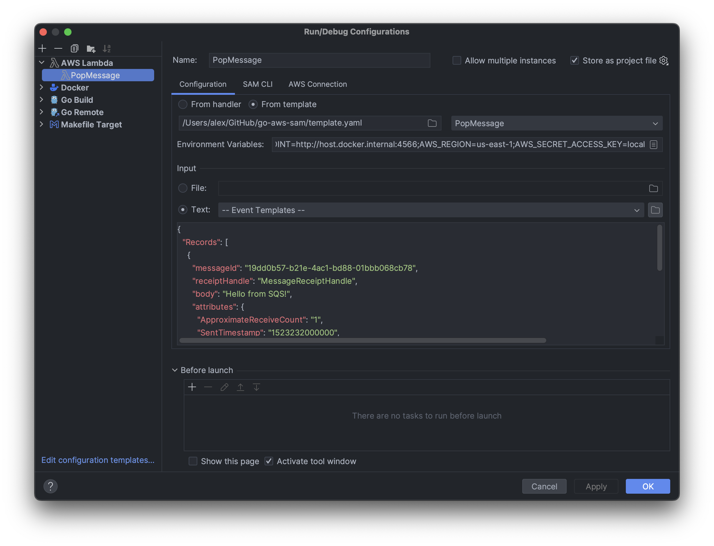

### Run **PopMessage** function.

- build function:
```
sam build PopMessage
```
- invoke function:
```
sam local generate-event sqs receive-message --body 'Hello, World!' | sam local invoke -e - PopMessage
```
---

- debug function:
```
sam local invoke PopMessage -e events/event.json -d 2345 --debugger-path=delve --debug-args="-delveAPI=2" --debug
```

- build binary:
```
GOOS=linux GOARCH=amd64 CGO_ENABLED=0 GO111MODULE=auto go build -o handler-bin
```
- create ZIP archive:
```
zip pop-message.zip handler-bin
```

- show logs:
```
aws logs tail /aws/lambda/pop-message --follow --endpoint-url=http://localhost:4566 --profile localstack
```
---

- create IDE configuration to run/debug:

---
